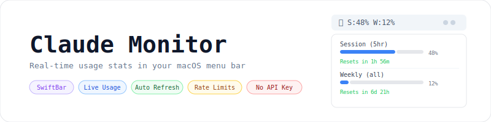

<p align="center">
    <picture>
        <source media="(prefers-color-scheme: dark)" srcset="art/banner-dark.svg">
        <source media="(prefers-color-scheme: light)" srcset="art/banner-light.svg">
        
    </picture>
</p>

<p align="center">Real-time Claude usage stats in your macOS menu bar -- no API key required.</p>

<p align="center">
    <a href="https://github.com/jeremykenedy/claude-swiftbar-monitor/stargazers"></a>
    <a href="https://github.com/jeremykenedy/claude-swiftbar-monitor/blob/main/LICENSE"></a>
    
    
</p>

---

## Table of Contents

- [Features](#features)
- [Requirements](#requirements)
- [Installation](#installation)
- [What It Shows](#what-it-shows)
- [How It Works](#how-it-works)
- [Configuration](#configuration)
- [Troubleshooting](#troubleshooting)
- [License](#license)

---

## Features

- Session usage percentage with progress bar (5hr rolling window)
- Weekly usage for all models and Sonnet-only
- Live reset countdowns for each limit
- Rate limit logger -- log when Claude locks you out and track when it lifts
- Auto-refreshes every minute from claude.ai directly
- Blue progress bars, green reset times -- readable on light and dark menus
- No API key, no tokens consumed, no external dependencies beyond SwiftBar

---

## Requirements

- macOS 12 or later
- [SwiftBar](https://github.com/swiftbar/SwiftBar) installed via `brew install --cask swiftbar`
- Google Chrome logged into claude.ai
- Chrome setting: **View > Developer > Allow JavaScript from Apple Events** must be enabled

---

## Installation

**1. Install SwiftBar**

```bash
brew install --cask swiftbar
```

**2. Clone this repo or download the script**

```bash
git clone https://github.com/jeremykenedy/claude-swiftbar-monitor.git
```

**3. Copy the plugin to your SwiftBar plugins folder**

```bash
cp claude-swiftbar-monitor/claude-stats.1m.sh ~/Documents/SwiftBar-plugins/
chmod +x ~/Documents/SwiftBar-plugins/claude-stats.1m.sh
```

**4. Set your SwiftBar plugins folder**

```bash
defaults write com.ameba.SwiftBar PluginDirectory ~/Documents/SwiftBar-plugins
```

**5. Launch SwiftBar**

```bash
open /Applications/SwiftBar.app
```

**6. Enable JavaScript from Apple Events in Chrome**

In Chrome menu bar: **View > Developer > Allow JavaScript from Apple Events**

That's it. You'll see **🤖 S:0% W:0%** in your menu bar within a minute.

---

## What It Shows

| Item | Description |
|------|-------------|
| `🤖 S:48% W:12%` | Menu bar label -- session % and weekly % at a glance |
| Session (5hr) | Your 5-hour rolling usage with progress bar and reset countdown |
| Weekly (all) | Weekly usage across all models |
| Weekly (Sonnet) | Weekly usage for Sonnet specifically |
| Rate limit logger | Log when Claude locks you out -- shows countdown until it lifts |

---

## How It Works

Every minute SwiftBar runs the shell script which uses AppleScript to execute a `fetch()` call in your open Chrome browser against the authenticated `claude.ai/api/organizations/{org_id}/usage` endpoint. The response is cached locally at `~/.claude/usage-cache.json`. No credentials are stored, no tokens are consumed -- it piggybacks on your existing browser session.

---

## Configuration

The refresh interval is set by the filename. To change it, rename the script:

| Filename | Refresh interval |
|----------|-----------------|
| `claude-stats.30s.sh` | Every 30 seconds |
| `claude-stats.1m.sh` | Every minute (default) |
| `claude-stats.5m.sh` | Every 5 minutes |

After renaming, restart SwiftBar.

---

## Troubleshooting

**🤖 shows but no data**
Make sure Chrome is open and logged into claude.ai. Check that "Allow JavaScript from Apple Events" is enabled in Chrome under View > Developer.

**SwiftBar icon disappears after closing Claude app**
Run `claude-monitor` in your terminal or add SwiftBar as a login item in System Settings > General > Login Items.

**Percentages stuck / not updating**
Click the 🤖 icon and hit **Refresh**. If still stuck, open any claude.ai tab in Chrome and try again.

---

## License

This project is open-sourced software licensed under the [MIT license](LICENSE).
