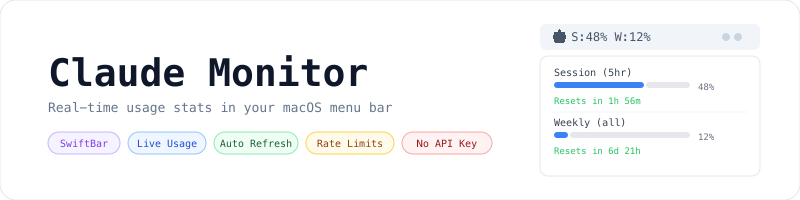
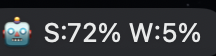
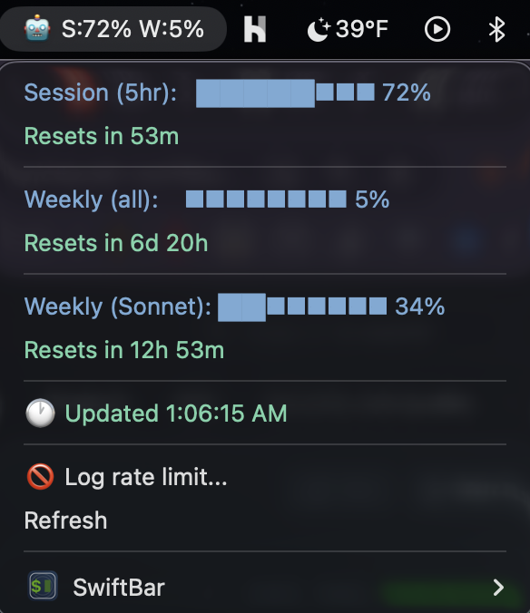

<p align="center">
    <picture>
        <source media="(prefers-color-scheme: dark)" srcset="art/banner-dark.png">
        <source media="(prefers-color-scheme: light)" srcset="art/banner-light.png">
        
    </picture>
</p>

<p align="center">Real-time Claude usage stats in your macOS menu bar -- no API key required.</p>

<p align="center">
    <a href="https://github.com/jeremykenedy/claude-swiftbar-monitor/stargazers"></a>
    <a href="https://github.com/jeremykenedy/claude-swiftbar-monitor/blob/main/LICENSE"></a>
    
    
</p>

---

## Table of Contents

- [Screenshots](#screenshots)
- [Features](#features)
- [Requirements](#requirements)
- [Installation](#installation)
- [What It Shows](#what-it-shows)
- [How It Works](#how-it-works)
- [Configuration](#configuration)
- [CLI Commands](#cli-commands)
- [Troubleshooting](#troubleshooting)
- [License](#license)

---

## Features

- Session usage percentage with progress bar (5hr rolling window)
- Weekly usage for all models and Sonnet-only
- Live reset countdowns for each limit
- Rate limit logger -- log when Claude locks you out and track when it lifts
- Auto-refreshes every minute from claude.ai directly
- Blue progress bars, green reset times -- readable on light and dark menus
- No API key, no tokens consumed, no external dependencies beyond SwiftBar

---

## Requirements

- macOS 12 or later
- [Homebrew](https://brew.sh) (for one-command install)
- Google Chrome logged into claude.ai
- SwiftBar (installed automatically by `claude-monitor install`)

---

## Installation

### Via Homebrew (recommended)

```bash
brew tap jeremykenedy/claude-monitor
brew install claude-monitor
claude-monitor install
```

That's it. The `claude-monitor install` command handles everything automatically:

- Installs SwiftBar if not already installed
- Downloads and installs the plugin
- Configures SwiftBar automatically
- Enables JavaScript from Apple Events in Chrome
- Launches SwiftBar

You'll see **🤖** in your menu bar within 60 seconds.

### Manual installation

```bash
git clone https://github.com/jeremykenedy/claude-swiftbar-monitor.git
mkdir -p ~/Documents/SwiftBar-plugins
cp claude-swiftbar-monitor/claude-stats.1m.sh ~/Documents/SwiftBar-plugins/
chmod +x ~/Documents/SwiftBar-plugins/claude-stats.1m.sh
defaults write com.ameba.SwiftBar PluginDirectory ~/Documents/SwiftBar-plugins
open /Applications/SwiftBar.app
```

Then enable JavaScript from Apple Events in Chrome: **View > Developer > Allow JavaScript from Apple Events**

---

## Screenshots

<p align="center">
  <br>
  <em>Menu bar label showing session and weekly usage at a glance</em>
</p>

<p align="center">
  <br>
  <em>Dropdown with live percentages, progress bars, and reset countdowns</em>
</p>

---

## What It Shows

| Item | Description |
|------|-------------|
| `🤖 S:48% W:12%` | Menu bar label -- session % and weekly % at a glance |
| Session (5hr) | Your 5-hour rolling usage with progress bar and reset countdown |
| Weekly (all) | Weekly usage across all models |
| Weekly (Sonnet) | Weekly usage for Sonnet specifically |
| Rate limit logger | Log when Claude locks you out -- shows countdown until it lifts |

---

## How It Works

Every minute SwiftBar runs the shell script which uses AppleScript to execute a `fetch()` call in your open Chrome browser against the authenticated `claude.ai/api/organizations/{org_id}/usage` endpoint. The response is cached locally at `~/.claude/usage-cache.json`. No credentials are stored, no tokens are consumed -- it piggybacks on your existing browser session.

---

## Configuration

The refresh interval is set by the filename. To change it, rename the script:

| Filename | Refresh interval |
|----------|-----------------|
| `claude-stats.30s.sh` | Every 30 seconds |
| `claude-stats.1m.sh` | Every minute (default) |
| `claude-stats.5m.sh` | Every 5 minutes |

After renaming, restart SwiftBar.

---

## CLI Commands

After installing via Homebrew, you have a `claude-monitor` command available:

| Command | Description |
|---------|-------------|
| `claude-monitor install` | Set up everything and launch |
| `claude-monitor update` | Update the plugin to latest version |
| `claude-monitor restart` | Restart SwiftBar |
| `claude-monitor status` | Show installation status |

---

## Troubleshooting

**🤖 shows but no data**
Make sure Chrome is open and logged into claude.ai. Check that "Allow JavaScript from Apple Events" is enabled in Chrome under View > Developer.

**SwiftBar icon disappears after closing Claude app**
Run `claude-monitor` in your terminal or add SwiftBar as a login item in System Settings > General > Login Items.

**Percentages stuck / not updating**
Click the 🤖 icon and hit **Refresh**. If still stuck, open any claude.ai tab in Chrome and try again.

---

## License

This project is open-sourced software licensed under the [MIT license](LICENSE).
